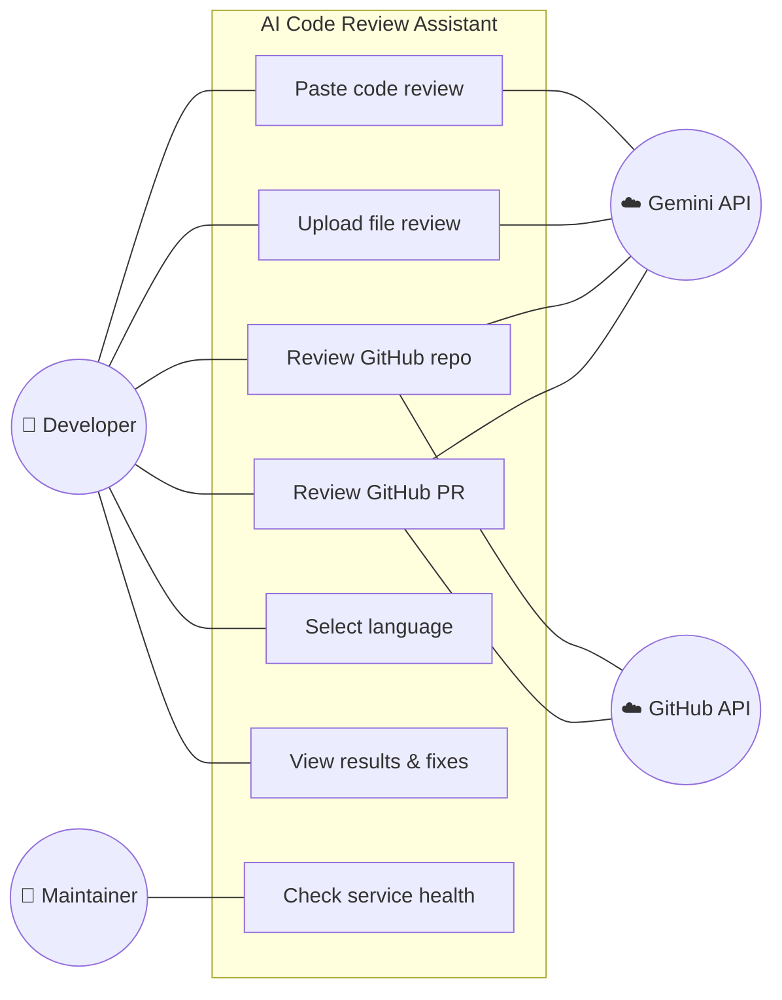
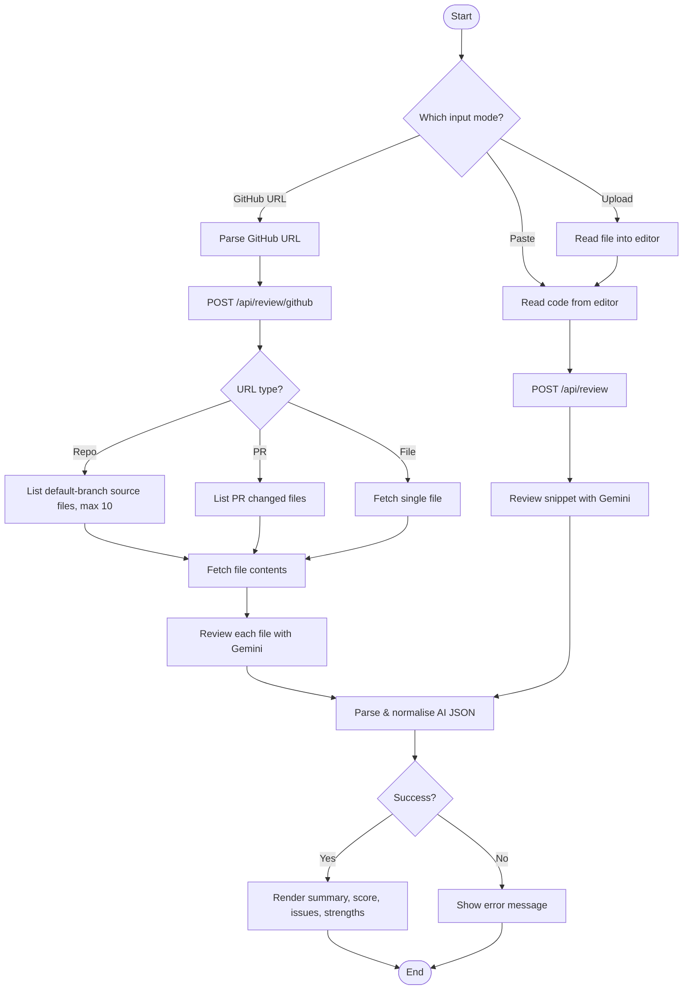
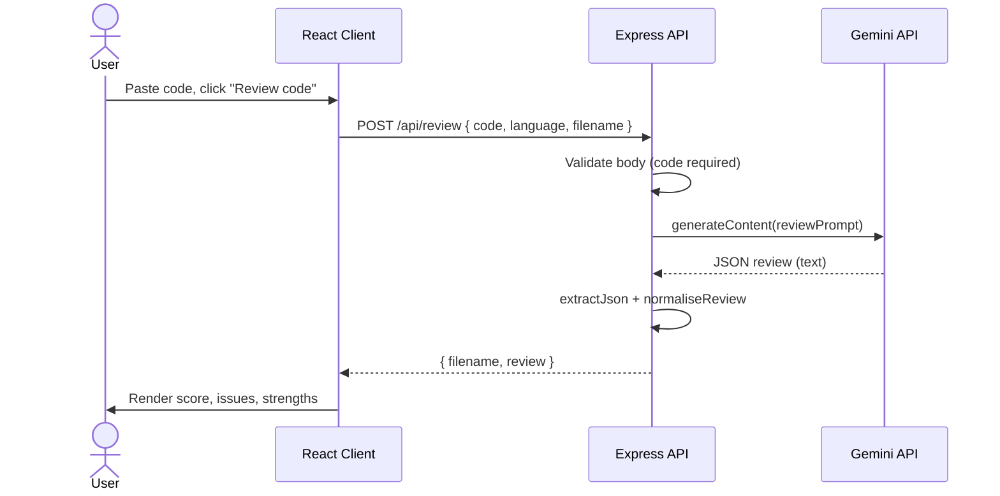
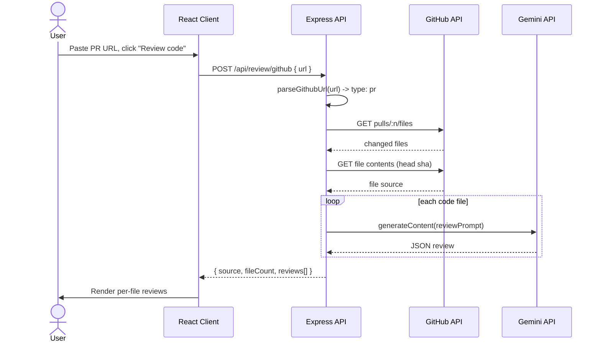
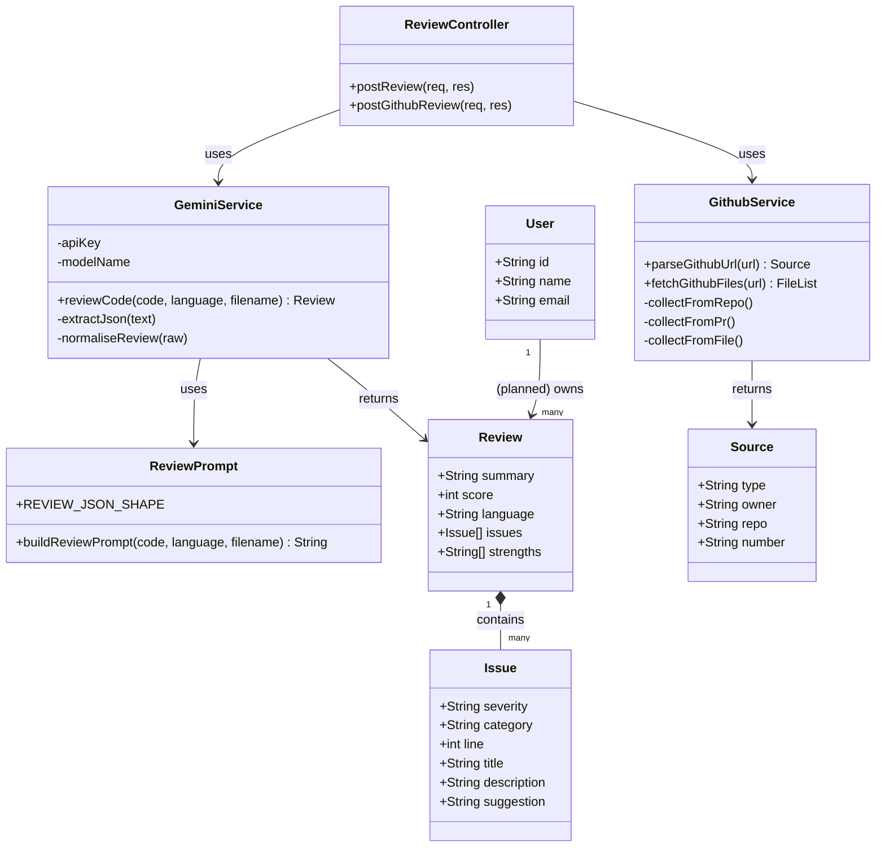
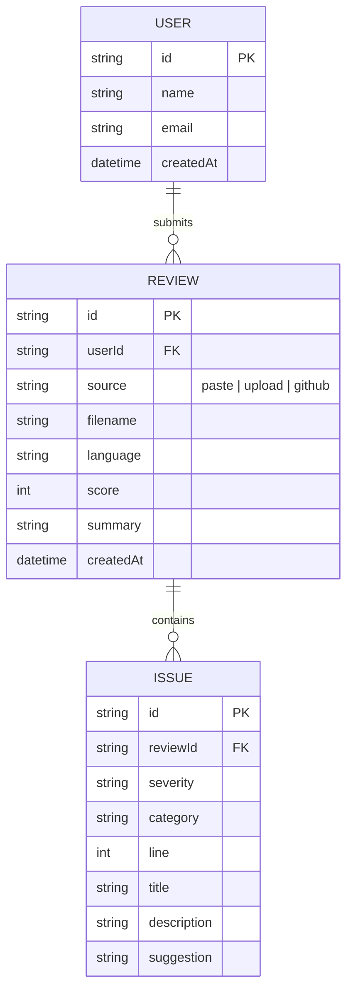
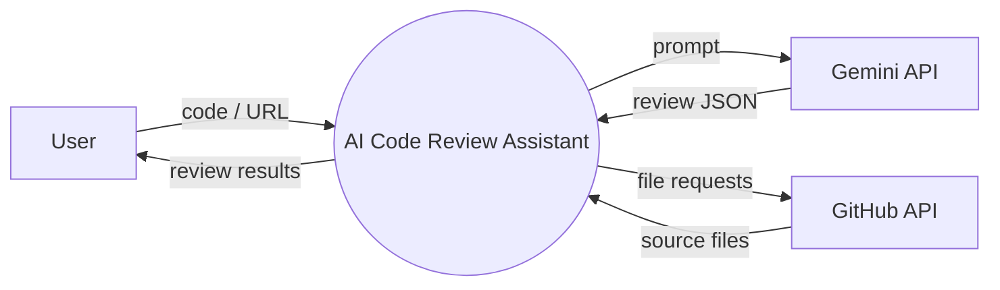
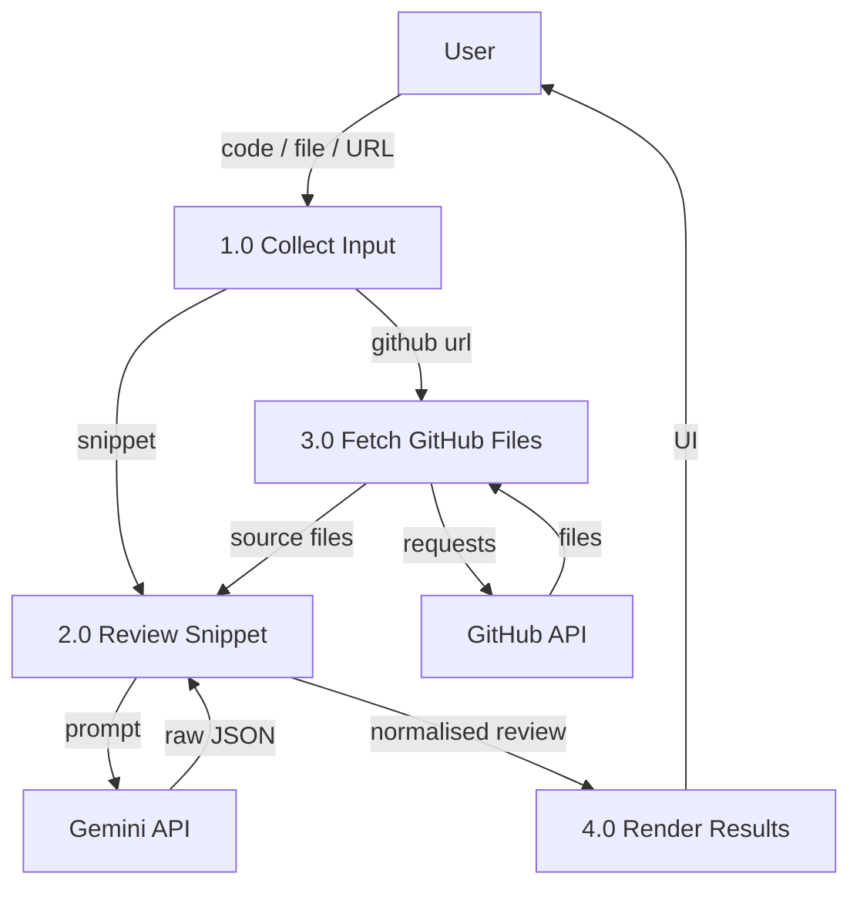

# System Design Document
### AI Code Review Assistant

| | |
|---|---|
| **Project** | AI Code Review Assistant |
| **Author** | Adyana Begum (22108150) |
| **Document version** | 1.0 |
| **Date** | 2026-06-23 |

This document presents the architecture and the mandatory UML diagrams. Diagrams
are written in **Mermaid**, which renders automatically on GitHub. The
`User`, `Review`, and `Issue` data entities described in the class and ER diagrams
are the **planned** persistence model for a later phase; the current build computes
reviews on demand without a database.

---

## Architecture Overview

```
┌──────────────────────────┐         ┌───────────────────────────┐
│      React Client        │  HTTP   │      Express Backend        │
│  (Vite + Monaco editor)  │ ──JSON─▶│                             │
│                          │         │  routes/review.js           │
│  • Paste / Upload / GH   │◀──JSON──│  services/gemini.js  ───────┼──▶ Gemini API
│  • Results panel         │         │  services/github.js  ───────┼──▶ GitHub API
└──────────────────────────┘         │  prompts/reviewPrompt.js    │
                                      └───────────────────────────┘
```

- **Presentation layer:** React components (`App.jsx`, `ReviewResults.jsx`).
- **API layer:** Express routes validating input and shaping responses.
- **Service layer:** `gemini.js` (AI review) and `github.js` (code fetching).
- **Prompt layer:** `reviewPrompt.js` defines the instruction and JSON contract.

---

## 1. Use Case Diagram



---

## 2. Activity Diagram — "Run a review"



---

## 3. Sequence Diagram — "Review a pasted snippet"



### Sequence Diagram — "Review a GitHub pull request"



---

## 4. Class Diagram

Models the backend modules (current build) plus the planned persistence entities.



---

## 5. ER Diagram (planned persistence model)

The current build is stateless. This is the schema planned for the database phase
(MongoDB collections / relational tables).



---

## 6. Data Flow Diagram

### Level 0 — Context diagram



### Level 1 — Decomposition



---

## 7. UI / UX Design Notes

The interface is a single screen with a fixed two-panel layout:

```
┌───────────────────────────────────────────────────────────────┐
│  ⟨/⟩  AI Code Review Assistant                  Powered by Gemini│
├──────────────────────────────┬────────────────────────────────┤
│  [ Paste ][ Upload ][ GitHub ]│   Results                       │
│  Language: [ auto ▼ ]         │   ┌──────────────────────────┐  │
│  ┌──────────────────────────┐ │   │ 📄 file.js      Score 78 │  │
│  │  Monaco code editor      │ │   │ 2 high · 1 medium        │  │
│  │                          │ │   │ ─ Issue: SQL injection   │  │
│  └──────────────────────────┘ │   │   Suggested fix: ...     │  │
│  [        Review code       ] │   └──────────────────────────┘  │
└──────────────────────────────┴────────────────────────────────┘
```

**Design principles applied:**
- **Dark, developer-focused theme** with a gradient accent for primary actions.
- **Severity colour-coding** (critical = red → info = grey) so problems are
  scannable at a glance; each issue card has a coloured left border and badges.
- **Score ring** with a red→green hue mapped to the 0–100 score for instant signal.
- **Responsive:** the two-column grid collapses to a single column under 900 px.
- **Feedback states:** empty prompt, animated spinner during analysis, and inline
  error text on failure.

Recommended tools for high-fidelity mockups (course requirement): **Figma** for the
landing/dashboard screens and **Canva** for presentation visuals. The implemented
layout above can be used directly as the reference for those mockups.

---

## 8. Technology & Component Mapping

| Component | Responsibility | File |
|-----------|----------------|------|
| App shell | Tabs, editor, run action, state | `client/src/App.jsx` |
| Results renderer | Score, issues, strengths | `client/src/components/ReviewResults.jsx` |
| API client | HTTP calls to backend | `client/src/api.js` |
| Server entry | Express app, health, errors | `server/src/index.js` |
| Routes | Request validation & response shape | `server/src/routes/review.js` |
| AI service | Gemini call, JSON parsing | `server/src/services/gemini.js` |
| GitHub service | Fetch repo/PR/file source | `server/src/services/github.js` |
| Prompt | Review instruction + JSON contract | `server/src/prompts/reviewPrompt.js` |
